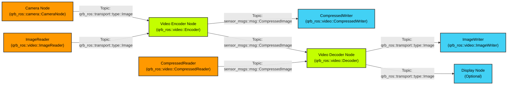

<div align="center">
  <h1>QRB ROS Video</h1>
  <p align="center">
    <!-- Add images or videos to showcase your project demo, use case, or logo -->
  </p>
  <p>Hardware-accelerated video processing package for Qualcomm robotics platforms</p>
  
  <a href="https://ubuntu.com/download/qualcomm-iot" target="_blank"></a>
  <a href="https://docs.ros.org/en/jazzy/" target="_blank"></a>
  
</div>

---

## 👋 Overview

> 📌 **QRB ROS Video Package Features**
> - Hardware-accelerated H.264/H.265 video encoding and decoding using Qualcomm VPU
> - Zero-copy memory management for high-performance video processing
> - Seamless integration with ROS 2 ecosystem and camera pipelines
> - Support for real-time video streaming and file I/O operations

> 📌 **System Architecture**



> 📌 **Architecture Components:**
> - **Video Encoder Node**: Converts raw images to compressed H.264/H.265 streams using Qualcomm VPU hardware
> - **Video Decoder Node**: Decodes compressed video streams back to raw image frames
> - **Camera Support**: Seamlessly accepts input from QRB ROS Camera package with zero-copy transport
> - **File I/O Components**: CompressedWriter and ImageWriter for saving video data to files
> - **Hardware Acceleration**: Leverages Qualcomm Video Processing Unit (VPU) for efficient encoding/decoding
> - **Memory Management**: Utilizes DMA buffers and qrb_ros_transport for zero-copy operations

## 🔎 Table of Contents

  * [APIs](#-apis)
  * [Supported Targets](#-supported-targets)
  * [Installation](#-installation)
  * [Usage](#-usage)
  * [Build from Source](#-build-from-source)
  * [Contributing](#-contributing)
  * [License](#-license)

## ⚓ APIs

### 🔹 QRB ROS Video APIs

#### ROS Interfaces

**Topics: Encoder**

| Topic | Message Type | Description |
|-------|-------------|-------------|
| `/input` | `qrb_ros::transport::type::Image` | Uncompressed YUV frames |
| `/output` | `sensor_msgs::msg::CompressedImage` | Compressed H.264/H.265 video stream |


**Topics: Decoder**

| Topic | Message Type | Description |
|-------|-------------|-------------|
| `/input` | `sensor_msgs::msg::CompressedImage` | Compressed H.264/H.265 video stream |
| `/output` | `qrb_ros::transport::type::Image` | Decoded YUV frames |

#### ROS Parameters

**Video Encoder Parameters:**

| Parameter | Type | Default | Description |
|-----------|------|---------|-------------|
| `format` | string | "h264" | Video codec format (h264/h265) |
| `pixel_format` | string | "nv12" | Input pixel format (nv12/p010) |
| `width` | int | 1920 | Video width |
| `height` | int | 1080 | Video height |
| `framerate` | int | 30 | Frames per second |
| `bitrate` | int | 5000000 | Target bitrate in bits/second |
| `rate_control` | string | "variable" | Rate control mode (variable/cbr) |
| `profile` | string | "main" | Codec profile (baseline/main/high) |
| `level` | string | "4.1" | Codec level |

**Video Decoder Parameters:**

| Parameter | Type | Default | Description |
|-----------|------|---------|-------------|
| `format` | string | "h264" | Input codec format |
| `pixel-format` | string | "nv12" | Output pixel format |

## 🎯 Supported Targets

- **Ubuntu 24.04 LTS (Noble)**
- **ROS 2 Humble and Jazzy**

Hardware Requirements:
- Qualcomm Video Processing Unit (VPU) for hardware acceleration
- Camera module compatible with qrb_ros_camera package (optional)

---

## ✨ Installation

### Prerequisites

```bash
# Install Qualcomm PPA
sudo add-apt-repository ppa:ubuntu-qcom-iot/qcom-ppa
sudo add-apt-repository ppa:ubuntu-qcom-iot/qirp
sudo apt update
```

### Install Packages

```bash
# Install QRB ROS Video packages
sudo apt install ros-jazzy-qrb-ros-video ros-jazzy-qrb-ros-video-test
```


## 🚀 Usage

Launch the video encoder for real-time video compression:

```bash
ros2 launch qrb_ros_video encoder_launch.py
```

Launch the video decoder for video decompression:

```bash
ros2 launch qrb_ros_video decoder_launch.py
```

**Example workflows:**

1. **Local Video File Recording:**
   ```bash
   # Terminal 1: Start video encoder
   ros2 launch qrb_ros_video encoder_launch.py
   ```

2. **Local Video File Playback:**
   ```bash
   # Terminal 1: Start video decoder
   ros2 launch qrb_ros_video decoder_launch.py
   ```
---

## 👨‍💻 Build from Source

```bash
# Install build tools and dependencies
sudo add-apt-repository ppa:ubuntu-qcom-iot/qcom-ppa
sudo apt update
sudo apt install build-essential cmake pkg-config

# Install ROS2 Jazzy (if not already installed)
# Follow instructions at https://docs.ros.org/en/jazzy/Installation.html
sudo apt install ros-jazzy-rclcpp ros-jazzy-rclcpp-components ros-jazzy-ament-cmake-auto ros-jazzy-std-msgs ros-jazzy-sensor-msgs ros-jazzy-qrb-ros-transport-image-type
```

### Step 2: Clone and Build

```bash
# Navigate to your ROS2 workspace
cd ~/ros2_ws/src

# Clone the repository (if not already cloned)
git clone https://github.com/qualcomm-qrb-ros/qrb_ros_video qrb_ros_video

# Build the test nodes
cd ~/ros2_ws
colcon build --packages-select qrb_ros_video

# Source the workspace
source install/setup.bash
```

## 🤝 Contributing

We love community contributions! Get started by reading our [CONTRIBUTING.md](CONTRIBUTING.md).  
Feel free to create an issue for bug reports, feature requests, or any discussion 💡.

## ❤️ Contributors

> 📌 **[Jean Xiao](jianxiao@qti.qualcomm.com)** 

## 📜 License

Project is licensed under the [BSD-3-clause License](https://spdx.org/licenses/BSD-3-Clause.html). See [LICENSE](./LICENSE) for the full license text.

