<div align="center">
  <h1>QRB Video V4L2 Library</h1>
  <p align="center">
    <!-- Add images or videos to showcase your project demo, use case, or logo -->
  </p>
  <p>Hardware accelerated video encoding and decoding library based on Linux V4L2 API</p>

  <a href="https://ubuntu.com/download/qualcomm-iot" target="_blank"></a>
  <a href="https://docs.ros.org/en/jazzy/" target="_blank"></a>

</div>

---

## 👋 Overview

> 📌 **Introduction to the project**
> - Hardware accelerated video codec library implementing encoding and decoding
> - Built on Linux V4L2 API for optimal performance on Qualcomm platforms
> - Supports multiple video codecs with unified C++ interface
> - Designed for real-time video processing applications

> 📌 **Architecture diagrams**

```mermaid
flowchart TD
    %% Application Layer
    subgraph APP ["🎯 Application Layer"]
        direction LR
        UserApp["👤 User Applications"]
        ROS2Node["🤖 ROS2 Video Nodes"]
    end
    
    %% QRB Video V4L2 Library API Layer
    subgraph API ["🔧 QRB Video V4L2 Library API"]
        direction LR
        VideoCodec["🎬 VideoCodec Interface<br/>Main API Entry Point"]
        Encoder["📤 Encoder<br/>Hardware Accelerated<br/>Video Encoding"]
        Decoder["📥 Decoder<br/>Hardware Accelerated<br/>Video Decoding"]

    
        %% Core Components Layer
        subgraph CORE ["⚙️ Core Components"]
            direction TB
            subgraph BUFFER ["Buffer Management System"]
                direction LR
                Buffer["� Buffer<br/>Data Container"]
                BufferPool["🏊 BufferPool<br/>Memory Pool"]
                BufferChannel["🔄 BufferChannel<br/>Communication"]
            end
            
            subgraph CONFIG ["Configuration & Control"]
                direction LR
                Settings["⚙️ Settings<br/>Codec Parameters"]
                Profile["📋 Profile/Level<br/>Codec Standards"]
                Format["🎨 Format Control<br/>Pixel Formats"]
            end
            
            subgraph EVENTS ["Event Management"]
                direction LR
                Notifier["🔔 Event Notifier<br/>Callbacks & Events"]
                Memory["💾 Memory Utils<br/>Low-level Memory"]
            end
        end
    end
    
    %% V4L2 Interface Layer
    subgraph V4L2 ["🐧 Linux V4L2 Interface"]
        direction LR
        V4L2Codec["🎯 V4L2 Codec Driver<br/>Hardware Interface"]
        V4L2Controls["🎛️ V4L2 Controls<br/>Device Configuration"]
    end
    
    %% Hardware Layer
    subgraph HW ["🔧 Hardware Layer"]
        direction LR
        VideoEncoder["📤 HW Video Encoder<br/>Dedicated Silicon"]
        QualcommSoC["🔥 Qualcomm SoC<br/>Main Processor"]
        VideoDecoder["📥 HW Video Decoder<br/>Dedicated Silicon"]
    end
    
    %% Main Data Flow
    UserApp --> VideoCodec
    ROS2Node --> VideoCodec
    VideoCodec --> Encoder
    VideoCodec --> Decoder
    
    %% API to Core connections
    Encoder --> BUFFER
    Decoder --> BUFFER
    Encoder --> CONFIG
    Decoder --> CONFIG
    Encoder --> EVENTS
    Decoder --> EVENTS
    
    %% Core to V4L2 connections
    BUFFER --> V4L2Codec
    CONFIG --> V4L2Controls
    EVENTS --> V4L2Codec
    
    %% V4L2 to Hardware connections
    V4L2Codec --> QualcommSoC
    V4L2Controls --> QualcommSoC
    QualcommSoC --> VideoEncoder
    QualcommSoC --> VideoDecoder
    
    %% Buffer flow details
    Buffer --> BufferPool
    BufferPool --> BufferChannel
    
    %% Configuration flow
    Settings --> Profile
    Profile --> Format
    
    %% Styling
    classDef appLayer fill:#e3f2fd,stroke:#1976d2,stroke-width:3px,color:#000
    classDef apiLayer fill:#f3e5f5,stroke:#7b1fa2,stroke-width:3px,color:#000
    classDef coreLayer fill:#fff8e1,stroke:#f57c00,stroke-width:2px,color:#000
    classDef v4l2Layer fill:#e8f5e8,stroke:#388e3c,stroke-width:3px,color:#000
    classDef hwLayer fill:#fce4ec,stroke:#c2185b,stroke-width:3px,color:#000
    classDef bufferGroup fill:#fff3e0,stroke:#f57c00,stroke-width:2px,color:#000
    classDef configGroup fill:#f1f8e9,stroke:#689f38,stroke-width:2px,color:#000
    classDef eventGroup fill:#fdf7ff,stroke:#8e24aa,stroke-width:2px,color:#000
    
    %% Apply classes
    class UserApp,ROS2Node appLayer
    class VideoCodec,Encoder,Decoder apiLayer
    class Buffer,BufferPool,BufferChannel bufferGroup
    class Settings,Profile,Format configGroup
    class Notifier,Memory eventGroup
    class V4L2Codec,V4L2Controls v4l2Layer
    class VideoEncoder,QualcommSoC,VideoDecoder hwLayer
```



> 📌 **Describe the architecture diagram:**
> - **🎯 Application Layer**: User applications and ROS2 video nodes that interact with the library through the main API
> - **🔧 QRB Video V4L2 Library API**: Core interface layer featuring VideoCodec as the main entry point, with specialized Encoder and Decoder implementations
> - **⚙️ Core Components**: Three main subsystems:
>   - **Buffer Management**: Handles video data containers, memory pooling, and inter-component communication
>   - **Configuration & Control**: Manages codec parameters, profiles/levels, and pixel format settings
>   - **Event Management**: Provides callback notifications and low-level memory utilities
> - **🐧 Linux V4L2 Interface**: Low-level interface to Linux kernel V4L2 subsystem with codec drivers and device controls
> - **🔧 Hardware Layer**: Qualcomm SoC with dedicated hardware video encoder and decoder units for optimal performance

## ⚓ APIs

### 🔹 QRB Video V4L2 Library APIs

#### Core Classes

**VideoCodec**
- Main interface for video codec operations
- Provides unified API for both encoding and decoding

**Encoder**
- Video encoding functionality with hardware acceleration
- Supports various encoding parameters and formats

**Decoder** 
- Video decoding functionality with hardware acceleration
- Handles multiple video formats and codecs

**Buffer Management**
- `Buffer`: Represents video data buffers
- `BufferPool`: Manages buffer allocation and recycling
- `BufferChannel`: Handles buffer communication between components
- `Memory`: Low-level memory management utilities

## 🎯 Supported Targets

- Qualcomm platforms with V4L2 hardware acceleration support

---

## ✨ Installation

### Prerequisites

```bash
# Install Qualcomm PPA
sudo add-apt-repository ppa:ubuntu-qcom-iot/qcom-ppa
sudo apt update

# Install required system dependencies
sudo apt install build-essential cmake libglog-dev pkg-config

# Ensure V4L2 development headers are available
sudo apt install libv4l-dev
```

### Install from Package

```bash
# Install deb packages
sudo apt install libqrb-video-v4l2-1
sudo apt install libqrb-video-v4l2-dev
```

## 🚀 Usage

### API Usage (Conceptual)
The primary interaction with the library involves:
1.  Creating an `Encoder` or `Decoder` instance using `Encoder::create(mime_type)` or `Decoder::create(mime_type)`.
2.  Configuring the instance using the `configure(Setting)` method. Settings are created using helper structs like `Profile`, `Level`, `Bitrate`, `Framerate`, `Resolution`, and `BufferCount`.
3.  Setting a `Notifier` to receive callbacks for events like buffer availability.
4.  Starting the codec using `start()`.
5.  Queueing input buffers (`queueBuffer()`) and acquiring/dispatching output buffers (`acquireBuffer()`, `dispatchBuffer()`).
6.  Stopping the codec using `stop()`.

### Configuration Parameters
Parameters are configured by creating a `Setting` object using the specific parameter structs defined in `VideoCodec.hpp`. The `configure(const Setting& s)` method of a `VideoCodec` instance is used to apply these settings.
**Note:** The V4L2 driver ultimately determines the supported values and ranges for these parameters.
#### 1. Codec MIME Type
  - **Description**: Specifies the video codec to be used. Passed as a string during `Encoder::create(mime_type)` or `Decoder::create(mime_type)`.
  - **Type**: `std::string`
  - **Constants Defined in `VideoCodec.hpp`**:
    - `qrb::video_v4l2::MIME_H264` (evaluates to "video/x-h264")
    - `qrb::video_v4l2::MIME_H265` (evaluates to "video/x-h265")
  - **Example**: `auto encoder_client = Encoder::create(MIME_H264);`
#### 2. Resolution
  - **Description**: Sets the width and height of the video frames. This setting likely also incorporates the Pixel Format for the port being configured.
  - **Struct**: `qrb::video_v4l2::Resolution`
    - `uint32_t width`
    - `uint32_t height`
  - **Setting Type Enum**: `qrb::video_v4l2::Setting::RESOLUTION`
  - **Example**:
    ```cpp
    qrb::video_v4l2::Resolution res;
    res.width = 1920;
    res.height = 1080;
    codec->configure(qrb::video_v4l2::Setting::create(res));
    ```
#### 3. Pixel Format (Handled via `Setting::FORMAT`)
  - **Description**: Specifies the pixel format for input video data (to encoder) or output video data (from decoder). The actual `enum class Format` definition needs to be located in the library's headers to list specific values (e.g., NV12, I420 for raw formats; or codec-specific formats). This is applied using `Setting::create(Format& format)`.
  - **Struct**: `qrb::video_v4l2::Format` (This is an enum, the actual struct passed to `Setting::create` would be an instance of this enum).
  - **Setting Type Enum**: `qrb::video_v4l2::Setting::FORMAT`
  - **Example**:
    ```cpp
    qrb::video_v4l2::Format fmt_setting = qrb::video_v4l2::Format::NV12;
    codec->configure(qrb::video_v4l2::Setting::create(fmt_setting));
    ```
  - **Note**: `V4l2Codec.hpp` defines `static const std::unordered_map<Format, uint32_t> formatMapping;`. The keys of this map would be the members of `enum class Format`.
#### 4. Framerate
  - **Description**: Sets the target frames per second.
  - **Struct**: `qrb::video_v4l2::Framerate`
    - `uint32_t value` (FPS)
  - **Setting Type Enum**: `qrb::video_v4l2::Setting::FRAMERATE`
  - **Example**:
    ```cpp
    qrb::video_v4l2::Framerate fr;
    fr.value = 30;
    codec->configure(qrb::video_v4l2::Setting::create(fr));
    ```
#### 5. Bitrate (Primarily for Encoders)
  - **Description**: Configures the target bitrate and mode.
  - **Struct**: `qrb::video_v4l2::Bitrate`
    - `int32_t value` (Target bitrate in bits per second)
    - `Mode mode` (Enum: `qrb::video_v4l2::Bitrate::OFF`, `qrb::video_v4l2::Bitrate::CBR` - Constant Bitrate, `qrb::video_v4l2::Bitrate::VBR` - Variable Bitrate)
    - `bool enable` (Set to `true` to apply bitrate control)
  - **Setting Type Enum**: `qrb::video_v4l2::Setting::BITRATE`
  - **Example**:
    ```cpp
    qrb::video_v4l2::Bitrate br;
    br.value = 4000000; // 4 Mbps
    br.mode = qrb::video_v4l2::Bitrate::Mode::CBR;
    br.enable = true;
    codec->configure(qrb::video_v4l2::Setting::create(br));
    ```
#### 6. Profile (Codec-Specific)
  - **Description**: Sets the codec profile (e.g., H.264 Baseline, Main, High; HEVC Main, Main10).
  - **Struct**: `qrb::video_v4l2::Profile`
    - `uint32_t value` (Use enums from `qrb::video_v4l2::Profile::`)
  - **Enums in `VideoCodec.hpp` (subset)**:
    - `qrb::video_v4l2::Profile::AVC_BASELINE`
    - `qrb::video_v4l2::Profile::AVC_CONSTRAINED_BASELINE`
    - `qrb::video_v4l2::Profile::AVC_MAIN`
    - `qrb::video_v4l2::Profile::AVC_HIGH`
    - `qrb::video_v4l2::Profile::AVC_CONSTRAINED_HIGH`
    - `qrb::video_v4l2::Profile::HEVC_MAIN`
    - `qrb::video_v4l2::Profile::HEVC_MAIN10`
    - `qrb::video_v4l2::Profile::HEVC_MAIN_STILL`
  - **Setting Type Enum**: `qrb::video_v4l2::Setting::PROFILE`
  - **Example**:
    ```cpp
    qrb::video_v4l2::Profile prof;
    prof.value = qrb::video_v4l2::Profile::AVC_HIGH;
    codec->configure(qrb::video_v4l2::Setting::create(prof));
    ```
#### 7. Level (Codec-Specific)
  - **Description**: Sets the codec level, indicating capabilities and constraints.
  - **Struct**: `qrb::video_v4l2::Level`
    - `uint32_t value` (Use enums from `qrb::video_v4l2::Level::`)
  - **Enums in `VideoCodec.hpp` (subset for H.264/AVC)**:
    - `qrb::video_v4l2::Level::AVC_1_0`, `AVC_1_B`, ..., `AVC_5_1`, ..., `AVC_6_2`
  - **Enums in `VideoCodec.hpp` (subset for H.265/HEVC)**:
    - `qrb::video_v4l2::Level::HEVC_1_0`, ..., `HEVC_5_1`, ..., `HEVC_6_2`
  - **Setting Type Enum**: `qrb::video_v4l2::Setting::LEVEL`
  - **Example**:
    ```cpp
    qrb::video_v4l2::Level lvl;
    lvl.value = qrb::video_v4l2::Level::AVC_4_1; // For H.264 Level 4.1
    codec->configure(qrb::video_v4l2::Setting::create(lvl));
    ```
#### 8. Buffer Count
  - **Description**: Hint for the number of buffers for input or output ports. The library has default counts (e.g., Decoder: 4 input, 12 output; Encoder: 12 input, 4 output, as seen in `V4l2BufferCount` defaults in `V4l2Codec.hpp`).
  - **Struct**: `qrb::video_v4l2::BufferCount`
    - `size_t value`
  - **Setting Type Enum**: `qrb::video_v4l2::Setting::COUNT`
  - **Example**:
    ```cpp
    qrb::video_v4l2::BufferCount bc;
    bc.value = 8; // Request 8 buffers for the port being configured (clarify if input/output specific)
    codec->configure(qrb::video_v4l2::Setting::create(bc));

### Checking Results

- Monitor encoding/decoding performance through system logs
- Verify hardware acceleration is active via V4L2 device status

---


## 👨‍💻 Build from Source

### Step 1: Install Dependencies

```bash
# Install build tools and dependencies
sudo apt update
sudo apt install build-essential cmake libglog-dev pkg-config libv4l-dev
```

### Step 2: Clone and Build

```bash
# Navigate to your workspace
cd /path/to/your/workspace

# Build the library
mkdir build && cd build
cmake ..
make -j$(nproc)

# Install the library
sudo make install
```

## ❔ FAQs

<details>
<summary>What video codecs are supported?</summary><br>
The library supports multiple video codecs through the V4L2 interface. Specific codec support depends on the underlying hardware platform capabilities. Common codecs include H.264, H.265, and others supported by Qualcomm hardware acceleration.
</details>

<details>
<summary>How do I check if hardware acceleration is working?</summary><br>
You can verify hardware acceleration by checking V4L2 device nodes (usually /dev/video*) and monitoring system performance. Hardware-accelerated encoding/decoding should show significantly better performance compared to software-only solutions.
</details>

<details>
<summary>What are the memory requirements?</summary><br>
Memory requirements depend on video resolution, frame rate, and codec settings. The library includes optimized buffer management to minimize memory usage while maintaining performance.
</details>